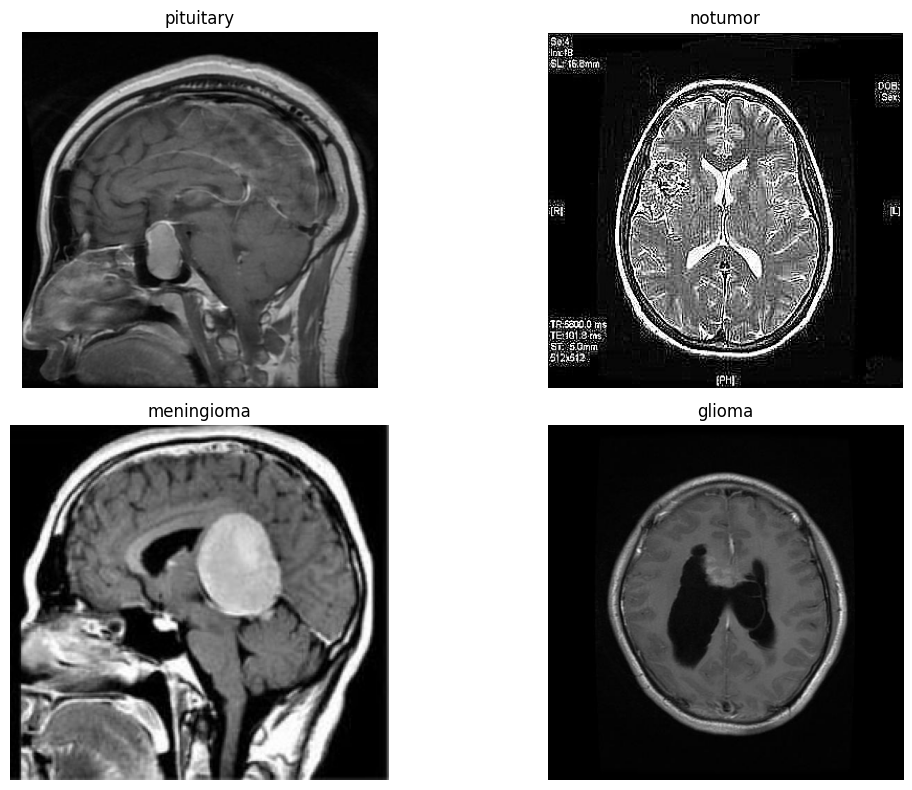
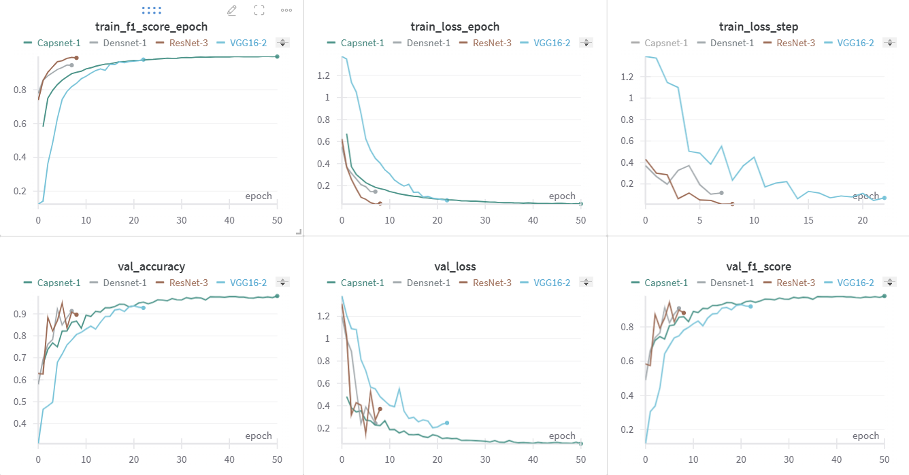
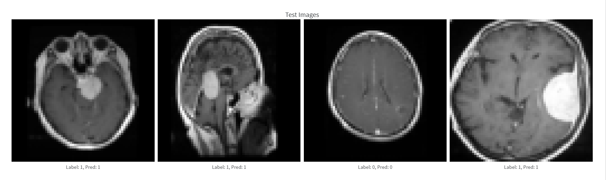

# Brain Tumor MRI Classification


## Overview 

Phân loại ảnh u não là một bài toán quan trọng trong lĩnh vực chẩn đoán hình ảnh y tế, nhằm hỗ trợ phát hiện sớm và xác định loại u não để lựa chọn phương pháp điều trị phù hợp, giúp cải thiện khả năng sống sót của bệnh nhân. Các khối u não có thể được phân loại thành 4 nhóm như u màng não (meningioma), u tuyến yên (pituitary), u thần kinh đệm (glioma), hoặc không có u thông qua việc phân tích và xử lý các ảnh cộng hưởng từ MRI

Tận dụng khả năng của các mạng học sâu, việc phân loại và nhận dạng các ảnh MRI chứa các khối u não trở nên nhanh chóng và hiệu quả. Dựa trên cảm hứng đó, trong dự án này, chúng tôi thực hiện huấn luyện các kiến trúc học sâu (VGG16, ResNet, DenseNet, ..) nhằm giải quyết bài toán trên. 


## Method

### Dataset 
Chúng tôi sử dụng bộ dữ liệu [Brain Tumor MRI](https://www.kaggle.com/datasets/masoudnickparvar/brain-tumor-mri-dataset/data)  bao gồm 7023 ảnh não người được chụp dưới dạng MRI với các kích thước khác nhau. Các ảnh được phân loại thành 4 loại chính như sau: 

<div align = "center">
    
</div>

1. **Glioma**: U não xuất phát từ các tế bào thần kinh đệm.
2. **Meningioma**: U màng não, thường lành tính.
3. **No Tumor**: Không phát hiện khối u.
4. **Pituitary** : U tuyến yên, có thể lành tính hoặc ác tính.

Bộ dữ liệu được chia thành 2 tập chính là train và test. Kích thước từng bộ dữ liệu lần lượt là 5712 cho bộ train và 1311 cho bộ test. Chi tiết các phân tích và xử lý bộ dữ liệu được trình bày [tại đây](notebooks/EDA.ipynb)


### Model 

Để giải quyết bài toán phân loại ảnh MRI u não, chúng tôi cài đặt lại, triển khai và so sánh hiệu suất của bốn mô hình hiện đại: ResNet50, DenseNet, VGG16, và CapsNet. Phụ thuộc vào bộ dữ liệu, chúng tôi đưa ra một số sửa đổi trong mạng gốc nhằm tối ưu về kết quả, thời gian huấn luyện và phần cứng trên bộ dữ liệu. Chi tiết về huấn luyện mô hình [tại đây](notebooks)


## Project Structure

```
├── .gitignore
├── configs              # chứa các file cấu hình 
│   └── example.yaml
├── data                 # chứa phần xử lý dữ liệu, eda 
│   └── __init__.py
├── infer.py             # file infer model 
├── model                # chứa cài đặt chi tiết các mô hình
│   └── __init__.py
├── model_cpt                # chứa các checkpoint của mô hình sau khi được huấn luyện
│   └── __init__.py
├── notebooks            # chứa các notebook cài đặt mô hình 
│   └── example.ipynb
├── README.md
└── train.py             # huấn luyện model 
```


## How to run 

Để chạy dựa án này, đầu tiên, bạn cần install các thư viện cần thiết: 

```
python -m venv <name>

<name>\Scripts\activate

pip install -r requirements.txt
```

Để huấn luyện các mô hình trên bộ dữ liệu, đầu tiên bạn cần download dữ liệu [tại đây](https://www.kaggle.com/datasets/masoudnickparvar/brain-tumor-mri-dataset/data) và lưu lại trong thư mục tên $ raw\_data $ sau đó thực hiện lệnh sau: 

```
python train.py -model_name=resnet -max_epochs=50
```


Để infer mô hình, thực hiện dòng lệnh sau: 

```
python infer.py -model_name=resnet -image_path=path/to/image
```

## Result 
Kết thúc quá trình huấn luyện, checkpoint của các mô hình được công khai [tại đây](model_cpt). Kết quả trong quá trình huấn luyện được chúng tôi công khai [tại](https://links-cdn.wandb.ai/wandb-public-images/links/trungviet17/82arcurq.html). Dưới đây là một số kết quả huấn luyện: 

<div align = "center">
    
</div>

Một số kết quả dự đoán của mô hình: 
<div align = "center">
    
</div>


## Members 
<table>
<tr>

  <td  valign="top" width="14.28%"><a href="https://github.com/Page0526"><br /><sub><b>Nguyễn Phương Trang</b></sub></a><br/></td>

  <td  valign="top" width="14.28%"><a href="https://github.com/trungviet17"><br /><sub><b>Nguyễn Ngô Việt Trung</b></sub></a><br/></td>

  <td  valign="top" width="14.28%"><a href="https://github.com/free-dino"><br /><sub><b>Trần Quốc Sáng </b></sub></a><br/></td>

  <td  valign="top" width="14.28%"><a href="https://github.com/trungnglight"><br /><sub><b>Nguyễn Quang Trung</b></sub></a><br/></td>

<td  valign="top" width="14.28%"><a href="https://github.com/CarolFiuf"><br /><sub><b>Nguyễn Tiến Trung</b></sub></a><br/></td>
<td  valign="top" width="14.28%"><a href="https://github.com/VinhLL"><br /><sub><b>Bùi Quang Vinh</b></sub></a><br/></td>

</tr>
</table>
